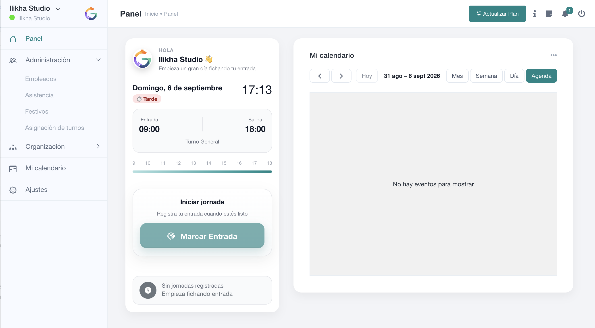

# Panel y fichaje diario

El **Panel** es la pantalla de inicio de SmartGRH. Para un empleado es el punto principal de la jornada: muestra el día, la hora actual, el turno previsto y el estado del fichaje. Para responsables y administradores sigue funcionando como acceso rápido a la operativa diaria.

## Qué ves en el panel

La tarjeta principal resume la jornada prevista. SmartGRH puede mostrar el **turno asignado**, la hora esperada de entrada y salida y una línea temporal de referencia. Si todavía no existe un registro de asistencia para ese día, la jornada aparece como no iniciada.

El botón **Marcar entrada** inicia el registro horario cuando el fichaje del empleado está permitido. Una vez iniciada la jornada, la misma zona del panel pasa a reflejar el estado del fichaje y permite continuar con la salida cuando corresponda.

A la derecha se muestra una vista compacta de **Mi calendario**, con navegación por mes, semana, día o agenda. Su contenido depende de las funciones habilitadas para la empresa y de los permisos del usuario.

## Registrar la entrada

1. Accede a SmartGRH con tu usuario.
2. Comprueba que el turno y las horas previstas corresponden al día actual.
3. Pulsa **Marcar entrada**.
4. Completa la información adicional que solicite tu empresa, si la hubiera.
5. Espera la confirmación de SmartGRH antes de cerrar la ventana o abandonar la página.

Según la configuración laboral, el fichaje puede registrar también **IP, ubicación y modalidad de trabajo**. La empresa puede restringir el fichaje a determinadas IP o a un radio geográfico alrededor del centro de trabajo.

> **Importante**  
> La hora registrada es la que acepta SmartGRH al guardar el fichaje. No debe considerarse fichada una entrada o salida hasta que la aplicación confirme la operación.

## Registrar la salida

Cuando ya existe una entrada abierta, SmartGRH permite completar la jornada con la salida. El registro resultante conserva la hora de entrada y salida y puede incorporar ubicación, IP, modalidad de trabajo y observaciones según la configuración de la empresa.

Si el turno atraviesa la medianoche, SmartGRH puede interpretar la salida como correspondiente al día siguiente cuando la hora de fin sea anterior a la de inicio. Esto evita que los turnos nocturnos se calculen como jornadas negativas.

## ¿Qué ocurre si me equivoco al fichar?

Un empleado no debe crear registros adicionales para intentar corregir un error. La corrección se realiza desde **Asistencia** por un usuario con permiso para añadir o editar registros. Consulta [Registrar o corregir un fichaje](../02-fichajes/registrar-modificar-fichaje.md).

## Mi calendario del panel

El calendario lateral es una vista rápida. La pantalla completa se encuentra en **Mi calendario**, donde pueden utilizarse filtros y cambiar entre las vistas mensual, semanal, diaria y agenda.
