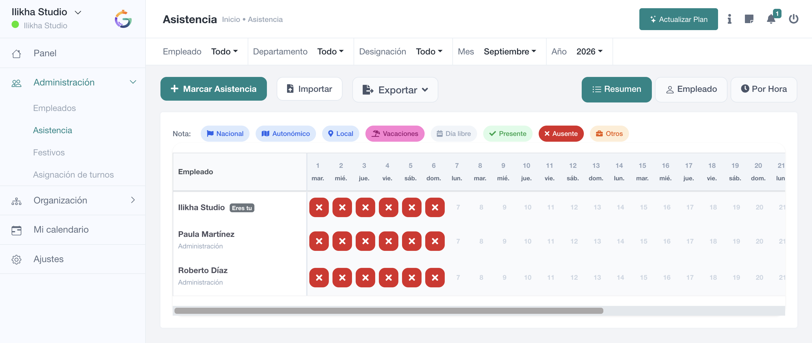

# Cómo leer la pantalla de Asistencia

Esta página sirve como referencia rápida para orientarse en la pantalla principal de **Administración → Asistencia**.

## 1. Filtros

En la parte superior puedes elegir **Empleado, Departamento, Designación, Mes y Año**. Estos filtros determinan qué plantilla y periodo se muestran y también deben revisarse antes de exportar.

## 2. Marcar Asistencia

El botón principal abre el formulario de alta manual. Solo aparece para usuarios con permiso de añadir asistencia. No debe utilizarse como alternativa al fichaje normal del empleado salvo que exista una incidencia que deba regularizarse.

## 3. Exportar e Importar

**Exportar** permite obtener el resumen actual y el registro legal cuando están disponibles. **Importar** inicia la carga masiva de asistencia y también depende de permisos.

## 4. Selector de vista

Los botones **Resumen**, **Empleado** y **Por Hora** cambian la lectura de los mismos datos. Cuando está activo el guardado de coordenadas puede aparecer también **Por ubicación**.

## 5. Leyenda

Antes de interpretar las celdas del calendario, revisa la leyenda: diferencia tipos de festivo, vacaciones, día libre, presente, ausente y otros.

## 6. Matriz mensual

Cada fila representa a un empleado y cada columna un día. En meses completos es normal tener que desplazarse horizontalmente. La matriz está diseñada para detectar excepciones; el detalle individual es la referencia antes de editar.
