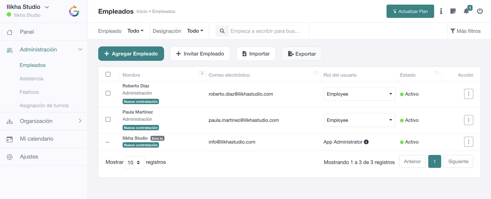

# Cómo leer la pantalla de Empleados

Esta página explica la pantalla principal **Administración → Empleados** de arriba abajo.

## 1. Filtros rápidos

En la parte superior aparecen los filtros de **Empleado** y **Designación**, el buscador y el acceso a **Más filtros**. Úsalos para reducir la plantilla antes de revisar, modificar o exportar información.

**Más filtros** puede incluir Departamento, Rol, Estado, Género y Tipo de empleo. Los filtros visibles dependen de la configuración y del permiso del usuario.

## 2. Agregar empleado

**Agregar Empleado** abre el formulario de alta. El alta directa es apropiada cuando administración dispone de los datos laborales de la persona y quiere dejar su ficha preparada desde el primer momento.

SmartGRH valida, entre otros aspectos, que el **identificador de empleado** no esté repetido dentro de la empresa y que el correo tenga formato válido y no esté ya utilizado.

## 3. Invitar empleado

**Invitar Empleado** permite incorporar a una persona mediante el flujo de invitación. Es útil cuando se quiere que el propio usuario complete el acceso a SmartGRH.

No debe confundirse la invitación con el estado laboral: después conviene comprobar que departamento, designación, fecha de incorporación y demás datos de RR. HH. sean correctos.

## 4. Importar y exportar

**Importar** admite ficheros de datos para altas en volumen. El proceso dispone de fase de correspondencia/procesado y gestión de excepciones de importación.

**Exportar** está sujeto a permisos y permite obtener los datos del listado sin tener que abrir las fichas una a una.

## 5. Tabla de empleados

La tabla identifica a cada persona mediante su nombre y correo. También muestra su **rol**, su **estado** y una columna de **Acción**.

El rol puede ser editable directamente desde el listado únicamente cuando el usuario conectado dispone del permiso de cambio de rol. No todos los responsables deben disponer de esta capacidad.

## 6. Estado

**Activo** indica que el usuario está operativo. Los empleados inactivos pueden consultarse mediante los filtros correspondientes.

Al desactivar una persona, SmartGRH puede exigir una **fecha de baja/último día** igual o posterior a su fecha de incorporación. Consulta [Estado y baja](estado-baja.md).

## 7. Menú de acciones

El menú de cada fila ofrece únicamente las acciones autorizadas para el usuario conectado. Entre ellas pueden encontrarse consultar la ficha, editar o eliminar, dependiendo del alcance de los permisos.

> **Si falta un botón**  
> Antes de considerar que existe un error, comprueba el rol y los permisos. SmartGRH oculta o bloquea acciones que el usuario no puede ejecutar.
