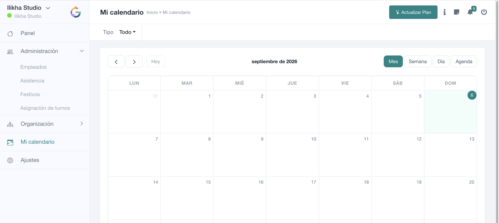
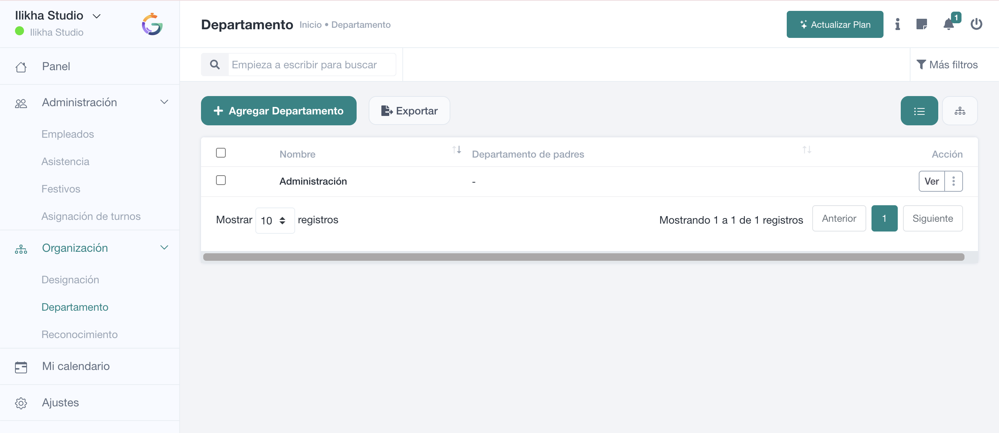

# Cómo leer las pantallas de Organización

Las pantallas de **Designación** y **Departamento** siguen un patrón muy parecido, lo que facilita administrar la estructura de la empresa.

## Designaciones

La parte superior incluye **búsqueda, Más filtros, Agregar Designación y Exportar**. Los iconos de vista permiten alternar entre la representación en **lista** y la **jerarquía**.

La tabla muestra el **Nombre**, la **Designación padre** y las **Acciones**. **Ver** abre la información del elemento y el menú adicional ofrece las operaciones autorizadas.

## Departamentos

La mecánica es equivalente: búsqueda, filtros, **Agregar Departamento**, exportación y cambio de vista. La tabla muestra el **Nombre**, el **Departamento padre** y las acciones disponibles.

## Lista frente a jerarquía

La **vista de lista** es mejor para localizar y editar elementos. La **vista jerárquica** ayuda a comprender las relaciones padre-hijo de la organización.

SmartGRH dispone de acciones específicas para modificar la relación padre de departamentos y designaciones. Antes de reorganizar la estructura, valora el efecto que tendrá en la lectura de la plantilla y en los filtros utilizados por RR. HH.

> **Consejo**  
> No utilices departamentos y designaciones como si fueran lo mismo. Un departamento responde a **dónde se integra la persona**; una designación responde a **qué puesto o función desempeña**.
