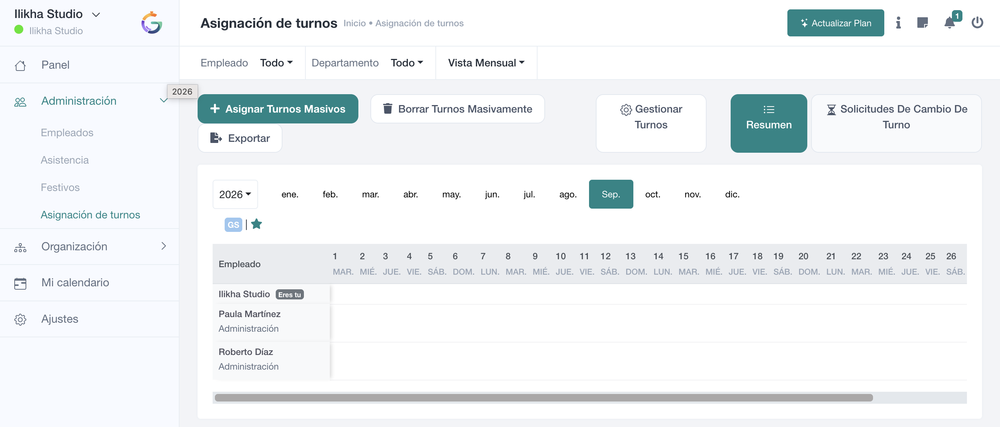

# Turnos y cuadrantes

**Asignación de turnos** permite planificar qué horario corresponde a cada empleado y cada día. Es una de las áreas centrales de SmartGRH porque el turno sirve de referencia para el fichaje, la asistencia y determinadas validaciones de jornada.

## Elementos de la pantalla

La vista ofrece filtros por **Empleado** y **Departamento**, selección de **Vista mensual**, navegación por año y por meses, y una matriz de empleados frente a días.

Las acciones principales incluyen **Asignar turnos masivos**, **Borrar turnos masivamente**, **Exportar** y **Gestionar turnos**.

La pestaña **Resumen** muestra el cuadrante. **Solicitudes de cambio de turno** concentra las peticiones enviadas para modificar un turno asignado.

## Qué significa una asignación

Cada celda del cuadrante vincula una fecha, un empleado y un turno. El código o identificador visual de cada turno se interpreta mediante la leyenda mostrada en la pantalla.

Continúa con:

- [Cuadrante mensual](cuadrante.md)
- [Asignación masiva](asignacion-masiva.md)
- [Borrado masivo](borrado-masivo.md)
- [Gestionar tipos de turno](configuracion-turnos.md)
- [Solicitudes de cambio](cambios-turno.md)
- [Rotaciones automáticas](rotaciones.md)
- [Exportar turnos](exportar-turnos.md)
