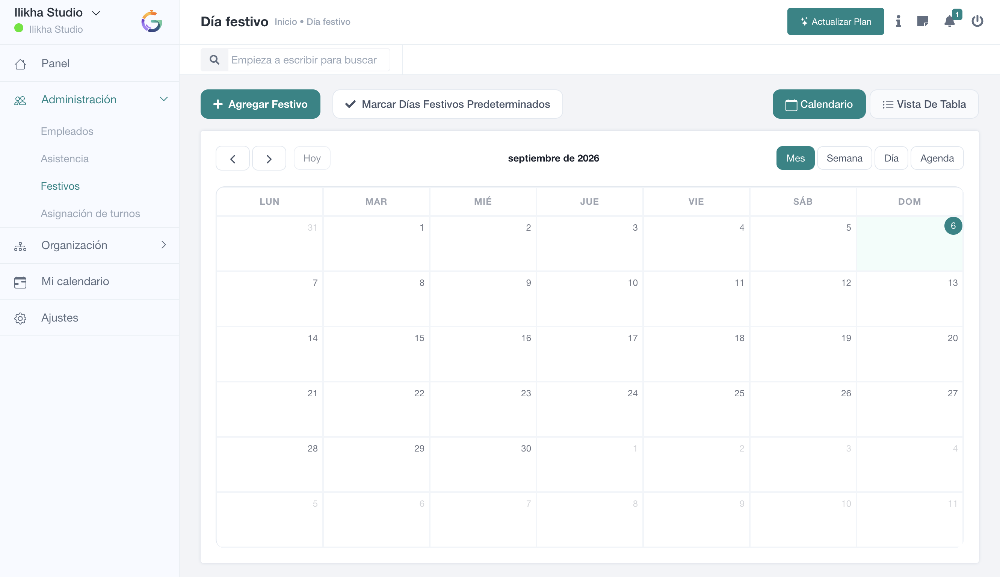

# Festivos

**Festivos** permite mantener el calendario no laborable utilizado por SmartGRH. Los festivos influyen en la interpretación de asistencia y en determinadas reglas de ausencias.

La pantalla dispone de búsqueda, **Agregar festivo**, **Marcar días festivos predeterminados**, vista **Calendario** y **Vista de tabla**.

- [Gestionar festivos](gestion-festivos.md)
- [Festivos predeterminados](predeterminados.md)
- [Aplicabilidad](aplicabilidad.md)
