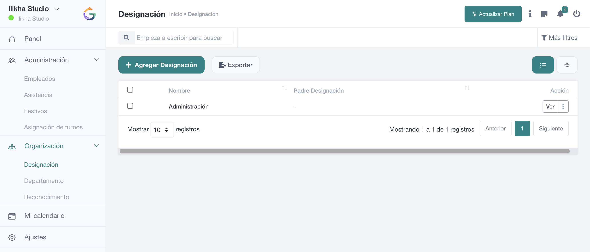

# Mi calendario

**Mi calendario** reúne en una vista temporal los elementos que afectan al usuario según los módulos habilitados en su cuenta.

## Navegación

Puedes avanzar o retroceder entre periodos, regresar a **Hoy** y alternar entre **Mes, Semana, Día y Agenda**. El filtro **Tipo** permite limitar los elementos mostrados cuando existen distintas clases de eventos.

El contenido del calendario puede alimentarse de funcionalidades como eventos, festivos, ausencias, tareas, tickets u otros módulos habilitados. Por eso el calendario de dos usuarios puede no mostrar exactamente la misma información.

## Uso recomendado

Utilízalo como visión personal de planificación. Para modificar la fuente de un evento —por ejemplo un festivo o una ausencia— entra en el módulo que originó ese elemento en lugar de intentar corregir únicamente su representación en el calendario.
