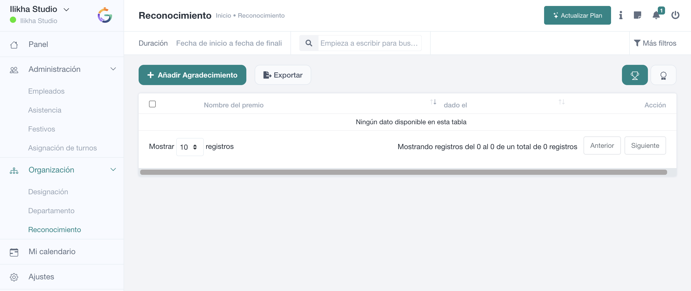

# Reconocimiento

**Organización → Reconocimiento** permite registrar agradecimientos o premios concedidos a empleados y conservar un histórico consultable según permisos.

## Cómo leer la pantalla

La parte superior incluye **filtro de periodo, búsqueda, Más filtros, Añadir Agradecimiento y Exportar**. Los controles de vista permiten cambiar la forma de presentar la información.

La tabla muestra, entre otros datos, el **nombre del premio**, la fecha en la que fue concedido y las acciones disponibles.

## Agradecimientos y tipos de premio

SmartGRH diferencia entre el **reconocimiento concedido a una persona** y el **tipo de premio/reconocimiento** que se utiliza para clasificarlo.

Un tipo de reconocimiento puede definir **título, icono, color de fondo y descripción/resumen**. Después se selecciona ese tipo al crear el reconocimiento para un empleado.

## Crear un reconocimiento

Al pulsar **Añadir Agradecimiento**, el formulario permite seleccionar:

- **Tipo de reconocimiento/premio**.
- **Empleado destinatario**.
- **Fecha**.
- **Resumen o descripción**.
- **Fotografía**, cuando se quiera adjuntar una imagen.

Los tres primeros datos son obligatorios en la validación del sistema.

## Permisos

La consulta utiliza el permiso `view_appreciation`; creación, edición y eliminación disponen de permisos propios. El alcance puede limitar la información que ve cada usuario.

La administración de los **tipos de premio** utiliza además el permiso `manage_award`.

> **Uso recomendado**  
> Mantén una lista corta y coherente de tipos de reconocimiento. Crear muchas variantes casi idénticas dificulta posteriormente filtrar y entender el histórico.

Continúa con [Crear un reconocimiento](crear-reconocimiento.md).
