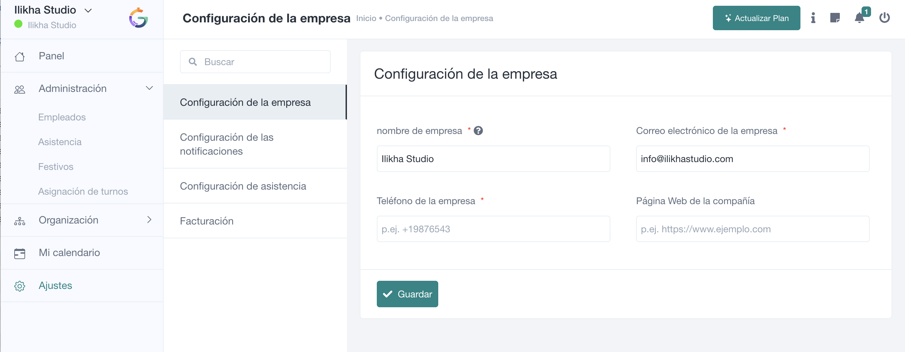

# Ajustes

**Ajustes** concentra la configuración de la organización. Su contenido cambia según el plan, los módulos activos y los permisos del usuario. En la configuración actual se muestran **Configuración de la empresa**, **Configuración de las notificaciones**, **Configuración de asistencia** y **Facturación**.

## Configuración de la empresa

Permite mantener los datos generales utilizados por SmartGRH, como **nombre de empresa**, **correo electrónico**, **teléfono** y **página web**. Los campos marcados con asterisco son obligatorios.

## Configuración de notificaciones

Determina qué avisos genera la aplicación y qué usuarios o roles los reciben según las funcionalidades habilitadas. Antes de desactivar una notificación, comprueba si forma parte de un proceso operativo de aprobación o control.

## Configuración de asistencia

Es uno de los apartados más importantes del sistema. El código activo de SmartGRH contempla opciones para:

- permitir cambios de turno;
- guardar la ubicación actual al fichar;
- permitir que el empleado fiche entrada y salida;
- fichaje automático y ubicación predeterminada;
- comprobación por radio geográfico y distancia permitida;
- mostrar u ocultar el botón de fichaje;
- comprobación por direcciones IP autorizadas;
- envío de informe mensual y selección de roles receptores;
- definir el primer día de la semana;
- activar recordatorios de asistencia y su margen temporal;
- habilitar **Who's in** para visualizar ubicación del equipo;
- mostrar los días de vacaciones disponibles en Asistencia;
- habilitar solicitudes de teletrabajo.

La combinación de estas opciones cambia directamente el comportamiento que experimenta el empleado al fichar.

## Código QR

SmartGRH dispone de configuración de fichaje mediante **QR**, con activación/desactivación y una URL asociada a la empresa. Si se utiliza un QR en un punto físico, debe tratarse como un acceso operativo: no conviene distribuirlo fuera de los lugares o personas previstos.

## Facturación

Desde **Facturación** se gestiona la relación del espacio de empresa con su plan cuando esta función está disponible. Las opciones concretas dependen del tipo de suscripción y del método de pago configurado.

> **Administradores:** cambia los ajustes de asistencia de forma controlada. Una modificación en ubicación, IP, auto-fichaje o permisos puede afectar inmediatamente a toda la plantilla.
